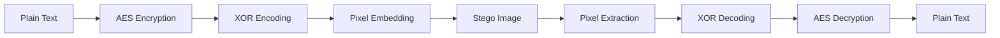

# Steganography - Secure Image-Based Data Hiding

[](https://www.python.org/downloads/)
[](LICENSE)
[]()

## 🔐 Overview

A robust steganography implementation that securely hides encrypted messages within digital images. This project combines AES encryption with XOR-based pixel embedding to ensure both **confidentiality** (through encryption) and **covert communication** (through steganography), making sensitive data transmission virtually undetectable.

### Key Features

- 🛡️ **AES-256 Encryption**: Messages encrypted using industry-standard AES in CBC mode
- 🎨 **Imperceptible Embedding**: XOR-based pixel manipulation maintains visual image quality  
- 🔑 **Key-Based Security**: Dual-layer protection with encryption keys and embedding keys
- 📸 **Lossless Support**: Optimized for PNG and BMP formats to prevent data corruption
- 🎯 **High Capacity**: Efficient byte-level embedding maximizes data storage

## 🚀 Quick Start

### Prerequisites

- Python 3.7 or higher
- Minimum 4GB RAM
- Compatible with Windows, Linux, and macOS

### Installation

1. **Clone the repository**
   ```bash
   git clone https://github.com/Debanga-06/Steganography.git
   cd Steganography
   ```

2. **Install dependencies**
   ```bash
   pip install opencv-python pycryptodome numpy
   ```

### Basic Usage

1. **Prepare your image**: Place your source image as `input.jpg` in the project directory

2. **Configure the script**: Edit `encrypt_stegano.py` to set your message and encryption key
   ```python
   text = "Your secret message here"
   key = "your-encryption-key"
   ```

3. **Hide your message**
   ```bash
   python encrypt_stegano.py
   ```

4. **Extract the message**: Run the script again and enter the same key when prompted

## 🏗️ Architecture

### Project Structure
```
steganography-project/
├── encrypt_stegano.py      # Main steganography implementation
├── input.jpg              # Source image file
├── encrypted_output.png    # Output image with hidden data
└── README.md              # Project documentation
```

### How It Works



#### Encoding Process
1. **Text Encryption**: Input text encrypted using AES-256 in CBC mode
2. **Key Derivation**: Encryption key processed through SHA-256 hashing
3. **XOR Encoding**: Encrypted bytes XORed with key characters for additional obfuscation
4. **Pixel Modification**: Encoded bytes embedded into RGB pixel values using bitwise operations
5. **Image Generation**: Modified image saved in lossless format

#### Decoding Process
1. **Pixel Extraction**: Retrieve embedded bytes from RGB channels
2. **XOR Decoding**: Reverse XOR operation using the same key
3. **AES Decryption**: Decrypt byte stream to recover original text
4. **Message Recovery**: Display decrypted plaintext message

## 📋 Requirements

### System Requirements
- **OS**: Windows 10+, macOS 10.14+, or Linux (Ubuntu 18.04+)
- **Memory**: 4GB RAM minimum, 8GB recommended for large images
- **Storage**: 100MB free space for dependencies and temporary files

### Image Format Support
- ✅ **Recommended**: PNG, BMP (lossless formats)
- ❌ **Not Supported**: JPEG, WebP (lossy compression affects embedded data)

### Dependencies
```
opencv-python>=4.5.0
pycryptodome>=3.15.0
numpy>=1.19.0
```

## ⚙️ Configuration

### Security Settings
```python
# Encryption configuration
ENCRYPTION_METHOD = "AES-256-CBC"
KEY_DERIVATION = "SHA-256"
BLOCK_SIZE = 16

# Embedding configuration  
EMBEDDING_METHOD = "XOR"
CHANNELS = ["R", "G", "B"]
```

### Performance Tuning
- **Small messages** (< 1KB): Use any image size
- **Medium messages** (1-10KB): Recommended minimum 512x512 pixels
- **Large messages** (> 10KB): Use high-resolution images (1080p+)

## 🔧 Advanced Usage

### Custom Key Management
```python
import hashlib

def generate_secure_key(password: str) -> str:
    """Generate a secure key from password"""
    return hashlib.sha256(password.encode()).hexdigest()[:32]
```

### Batch Processing
```python
def process_multiple_images(image_list, message, key):
    """Hide same message in multiple images"""
    for image_path in image_list:
        # Process each image
        pass
```

## 🧪 Testing

Run the included test to verify installation:
```bash
python -c "import cv2, Crypto, numpy; print('All dependencies installed successfully!')"
```

## 🚨 Limitations & Considerations

### Technical Limitations
- **Key Dependency**: Exact key required for decryption (no recovery mechanism)
- **Format Restrictions**: Lossy formats (JPEG) not supported due to data corruption
- **Capacity Limits**: Message size limited by image dimensions and color depth

### Security Considerations
- **Key Storage**: Store encryption keys securely and separately from images
- **Steganalysis**: Advanced detection methods may identify modified pixels
- **File Metadata**: Consider removing EXIF data to prevent information leakage

### Performance Notes
- Processing time increases with image size and message length
- Memory usage scales with image resolution
- Larger images provide better embedding capacity and security

## 🛣️ Roadmap

### Short Term (v2.0)
- [ ] GUI interface with Tkinter
- [ ] Support for additional image formats
- [ ] Batch processing capabilities
- [ ] Progress indicators for large files

### Medium Term (v3.0)
- [ ] Web interface with Flask/React
- [ ] Audio and video steganography
- [ ] Advanced LSB techniques
- [ ] Mobile app development

### Long Term (v4.0)
- [ ] Machine learning-based embedding
- [ ] Steganalysis detection tools
- [ ] Cloud-based processing
- [ ] API for third-party integration

## 🤝 Contributing

We welcome contributions! Please see our [Contributing Guidelines](CONTRIBUTING.md) for details.

### Development Setup
1. Fork the repository
2. Create a feature branch: `git checkout -b feature-name`
3. Make your changes and test thoroughly
4. Submit a pull request with detailed description

### Code Style
- Follow PEP 8 guidelines
- Add docstrings for all functions
- Include unit tests for new features
- Update documentation as needed

## 📄 License

This project is licensed under the MIT License - see the [LICENSE](LICENSE) file for details.

## 👨‍💻 Author

**Debanga Guria**  
B.Tech CSE – AI & ML  
Brainware University  

📧 Contact: [Your Email]  
🔗 LinkedIn: [Your LinkedIn Profile]  
🌐 Portfolio: [Your Website]

## 🙏 Acknowledgments

- OpenCV community for image processing capabilities
- PyCryptodome developers for robust encryption implementation
- NumPy team for efficient numerical operations

## 📚 References

- [Steganography: A Survey](https://example.com) - Academic research on steganography techniques
- [AES Encryption Standards](https://example.com) - NIST documentation on AES
- [Digital Image Processing](https://example.com) - Comprehensive guide to image manipulation

---

⭐ If you find this project useful, please consider giving it a star on GitHub!

**Disclaimer**: This tool is intended for educational and research purposes. Users are responsible for compliance with local laws and regulations regarding encryption and data hiding technologies.
